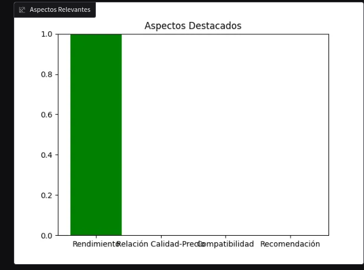
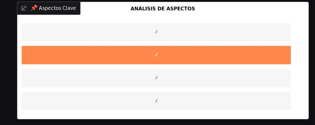
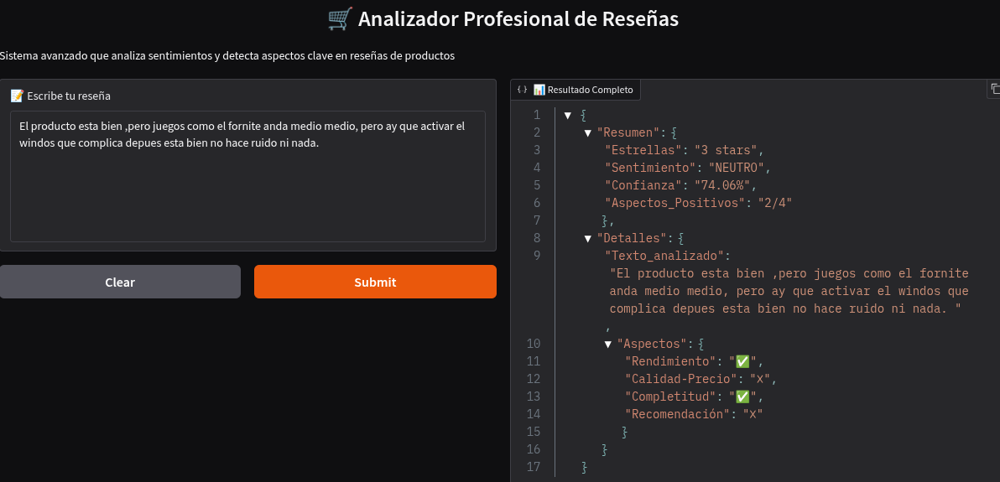
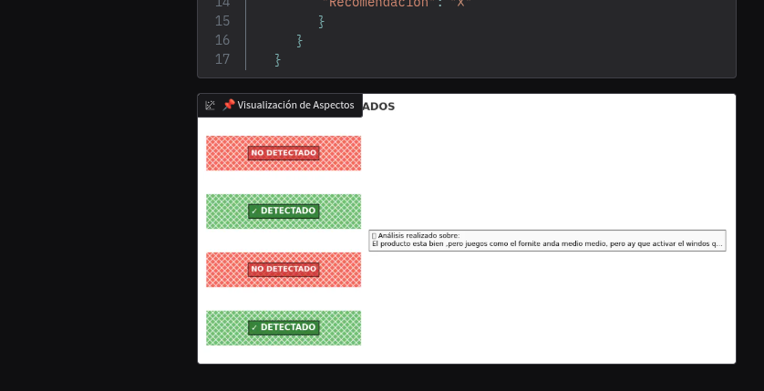

# sentiment_app
## app.py no funciona por algún problema que debo solucionar con tkinter
## app_1.py la probe con opiniones de Mercado libre sobre la compra de la GPU RTX3060 y funciona muy bien
## app_2.py funciona bien, hay que ajustar los graficos

*Funcionalidades Adicionales que Puedes Agregar:
Exportar resultados (botón para descargar análisis en JSON/CSV)

Historial de análisis (usando SQLite para almacenar consultas)

Análisis comparativo (comparar múltiples reseñas)

Sistema de puntuación personalizado (adaptado a tus criterios)

*💡 Consejo para tu Portfolio:
Menciona cómo:

Implementaste análisis de aspectos específicos sin necesidad de entrenar un modelo nuevo

Creaste visualizaciones integradas directamente en la interfaz

Optimizaste el modelo para entendimiento de lenguaje técnico en español

# Un ejemplo de funcionamiento: 
Bueno ! pero al comprar nunca imaginé que no venía con los cables de conexión.

{
"Estrellas"
:
"3 stars"
,
"Sentimiento"
:
"NEUTRO"
,
"Confianza"
:
"42.97%"
,
"Aspectos"
:
{
"Rendimiento"
:
true
,
"Relación Calidad-Precio"
:
false
,
"Compatibilidad"
:
false
,
"Recomendación"
:
false
}
}

